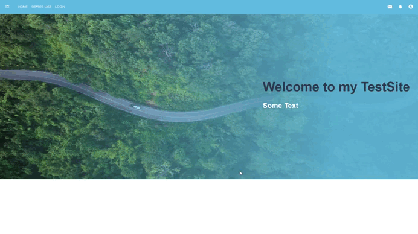

# Website test project
> Using API for an authentication (basic auth) and get data

It's my implementation of a Tech task. Techs/tools used:

- Vite
- React
- Typescript
- MUI
- React router
- Axios
- React Hook Form

## Demo




## Installing / Getting started

1. Clone the repo
   ```sh
   git clone https://github.com/AkaNPC/Website-test-project.git
   ```
2. Open projects directory
   ```sh
   cd Website-test-project/
   ```
3. Install NPM packages
   ```sh
   npm install
   ```
4. Start app
   ```sh
   npm run dev
   ```
   or
   ```sh
   npm run
   ```

## Features

- You need to login/authenticate for going to DeviceList page (protected route)
- If you don't have email, password for login (server has basic auth method), you can request them by sending a message to my email (see [Links](#links)). I'll add some registration form and demo-login mode for users later
- You can check validation pattern rules, including email and password regex in Login file
- You'll see a Modal error window, if server authorization will failed (incorrect login/password or some server errors)
- After successful auth you will redirect to Home page
- You can login / logout by clicking Profile => Login / Logout button in NavBar (with redirection to Login page)
- In DeviceList page you can click Show All for rendering all devices list from API data or find only one device by entering specific id in Search input field. Server data object has only two id by default (2 and 9).
- If you'll enter other id values in Search input field, you'll get an error (Modal window)
- You can change colors of app elements (text, bg etc.) by changing color codes in custom MUI theme creator in main.tsx file (root directory)

## File Structure

 ```sh
 ┣ public
 ┃ ┗ images
 ┃ ┃ ┣ demo.gif
 ┃ ┃ ┣ favicon.ico
 ┃ ┃ ┗ homeBgImage.jpg
 ┣ src
 ┃ ┣ components
 ┃ ┃ ┣ modal
 ┃ ┃ ┃ ┗ AlertModal.tsx
 ┃ ┃ ┗ NavBar.tsx
 ┃ ┣ context
 ┃ ┃ ┗ DataProvider.tsx
 ┃ ┣ pages
 ┃ ┃ ┣ DeviceList
 ┃ ┃ ┃ ┣ DeviceList.tsx
 ┃ ┃ ┃ ┣ DevicesNavBar.tsx
 ┃ ┃ ┃ ┗ SearchField.tsx
 ┃ ┃ ┣ Home.tsx
 ┃ ┃ ┗ Login.tsx
 ┃ ┣ services
 ┃ ┃ ┗ apiData.tsx
 ┃ ┣ utils
 ┃ ┃ ┣ formatDate.tsx
 ┃ ┃ ┗ PrivateRoute.tsx
 ┃ ┣ App.tsx
 ┃ ┣ main.tsx
 ┃ ┗ vite-env.d.ts
 ┣ .eslintrc.cjs
 ┣ .gitignore
 ┣ index.html
 ┣ package-lock.json
 ┣ package.json
 ┣ README.md
 ┣ tsconfig.json
 ┣ tsconfig.node.json
 ┗ vite.config.ts
   ```

## Links

Project homepage: https://github.com/AkaNPC/Website-test-project
  - If you have some ideas or in case of issues or sensitive bugs, please contact
    rtrkarat@gmail.com directly. I value your effort
    to improve this project!

## Licensing

"The code in this project is licensed under GNU Affero General Public License v3.0."
